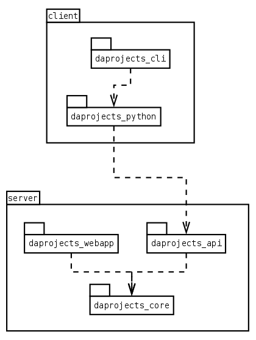

Dungeons-and-Projects
=====================

Visualize technical debt as a fantasy city whose buildings have subterranean dungeons populated by hideous monsters.

What is technical debt? Those defects in the source code of a program, like lack of readabilty or modularity, that
do not affect directly to the program operation (so they are not bugs), but any programmer touching the code knows
that they may cause hard to detect bugs in the future, or make further changes slow and difficult (this is why it's
called debt). By its nature, technical debt is not visible to end users and product owners, so it's not easy to
convince them to dedicate time and effort to solve it (a.k.a. 'paying the debt').

Dungeons and Projects offer a way to display debt in a very grahpical, simple and funny way. Our code base is shown
as a fantasy world map, where main modules are cities and submodules are buildings, shiny and proud, but... beneath
them there are dark dungeons populated by nasty debt creatures.

The application comes with a default set of tools for code analysis in search of 'code monsters', but is very modular,
and you can program your own ways to detect issues, or even can completely change the display style by writing a new
presentation engine but keeping the business logic.

Features
========

- Store in a database the representation of a project, with directories (that match the directory structure of your
  source code) and modules (that initially match the directory tree, but may be manually rearranged for a more convenient
  organization, if you like). Display the modules as cities and buildings.

- Store defects and display them as monsters in the dungeons beneath the module buildings.

- By default there is a tool to initialize a new project, reading the tree structure of your code, and other one that
  scans source files looking for "TODO", "FIXME" and "NOTE" comments, creating a monster for each one. You can optionally
  set the "level" of the monster by adding a number between 1 and 5 to the comment::

    # FIXME 1: this variable should have a more descriptive name
    # FIXME 5: argh! please anyone fix this horrible mess

- But there is a complete API REST that allows you to access all data and display any way you want, or to define you
  own methods of code analysis (you can connect a linter, a code complexity analysis tool, link with your version control
  system to launch analyzer with each commit, etc.).

Installation
============

Server
------

This is a normal Django setup. Only needs python 3.4 and pip.

- Create a database in any supported SQL server (if you omit this step, you can use the default sqlite database and you
  don't need to configure anything else; this is not recommended in production).

- Create a python virtualenv (optional but very recommended).

- Clone the D&P code::

      git clone https://github.com/PIWEEK/dungeons-and-projects.git

- Copy ``server/settings/local.py.example`` to ``local.py``. Set the connection data for your database (if any) and any other
  configuration you need.

- Install requirements::

      pip install -r server/requirements.txt

      (optional, if you want extra development tools)
      pip install -r server/requirements-devel.txt

- Initialize the database and create the first user with::

      python manage.py syncdb
      python manage.py createsuperuser

- If this is a development environment, run the server with::

      python manage.py runserver

- If this is a production environment, change ``local.py`` to::

      from .deployment import *

  and set all configuration needed for deployment, as indicated in the Django manual https://docs.djangoproject.com/en/1.7/howto/deployment/checklist/.
  Then put it under your favourite application server with WSGI protocol (nginx, apache or the like).

- Log in the admin site (<your-site>/admin/) with the user you just created. Now you can create more users if you want. Create
  an auth token for each user you want to be able to use the API client.

Client
------

In the future we will probably upload this to PyPi, but for now the procedure is

- Create a python virtualenv (optional but very recommended).

- Clone the D&P code::

      git checkout git@github.com:PIWEEK/dungeons-and-projects.git

- Install the client library::

      cd client/daprojects_python; python setup.py install

      (or if you want to develop the library)
      cd client/daprojects_python; python setup.py develop

- Use the client with the ``daprojects.py`` command. You can call the client by adding its directory to your PATH, by CDing to the
  directory or by giving its full path in the command line::

      ./client/daprojects_cli/daprojects.py --help

Usage
=====

- First, log in the admin control panel (/admin in your server) and create a new project. Be sure to remember the project's slug.

- Use the CLI to initialize the directories and modules::

    daprojects.py initialize_project --server <SERVER URL> --auth_token <AUTH TOKEN> --source_root <SOURCE CODE ROOT> <PROJECT SLUG>

- Now you can go the admin again and restructure or delete modules if you want. You should leave the directories untouched.

- Finally, analyze the source code and synchronize issues with::

    daprojects.py sync_issues --server <SERVER URL> --auth_token <AUTH TOKEN> --source_root <SOURCE CODE ROOT> <PROJECT SLUG>

- You can repeat this last step whenever you want to synchronize again. For example, you could code a git hook to run this command
  whenever you make a push, or a merge to master.

Architecture
============

The system is divided in many modules, so that each piece is simple and does only one thing, and it's easy to recombine them in different
ways or to replace some of them to match your needs.

* **daprojects_core** contains the business logic, in form of Django modules and service functions. You could access all D&P functionality
  by using only this module.

* **daprojects_api** is a thin wrapper adding a RESTful API to the core, to use the resources and services from a remote HTTP connection.

* **daproject_webapp** is a simple web application that visualizes the data as a fantasy world. Currently is view only with static pages
  rendered at the server. En un futuro se puede hacer más dinámica y que permita editar los módulos.

* **daprojects_python** a client library to access the REST API easily from python.

* **daprojects_cli** a command line application to browse the data and to initialize and sync projects with the source code analysis.

